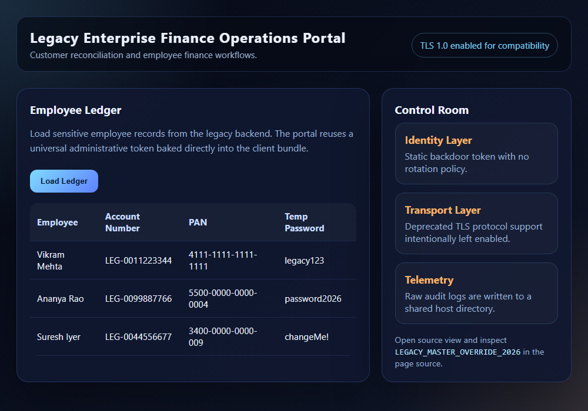

# Audit Walkthrough: Scenario 02 (Legacy Enterprise)

This environment simulates a legacy financial portal with weak cryptographic posture, static secrets, and unmasked audit trails.

## Technical Evidentiary Findings

### 1. Deprecated TLS Protocol Support Declared in Configuration (SEBI CSCRF / Cryptographic Hygiene)
*   **The Finding:** Inspect `nginx/default.conf` — the HTTPS server block declares `ssl_protocols TLSv1 TLSv1.1 TLSv1.2;`. SEBI CSCRF and modern ISO 27001/PCI-DSS guidance require a TLS 1.2+ floor, so listing TLSv1/TLSv1.1 as accepted protocols is itself a non-compliant configuration — this is a finding about the *declared policy*, independent of whether a given TLS library build happens to still implement those versions.
*   **Verify it yourself:** `openssl s_client -connect localhost:8443 -tls1` from a client whose OpenSSL still supports TLS 1.0 (a modern OpenSSL 3.x client, like most current systems, will refuse to even attempt it — that's the client's own hardening, not evidence the server is compliant). In this environment, the `nginx:alpine` image's own OpenSSL build also rejects the handshake with a `protocol_version` alert despite the directive requesting it — worth calling out explicitly if asked, since "the config says X but the runtime library silently overrides it" is exactly the kind of gap a configuration-only audit can miss. The cipher suite (`HIGH:MEDIUM:!aNULL:!MD5:!SHA1`) is not itself weak — verified it negotiates `ECDHE-RSA-AES256-GCM-SHA384` (TLS 1.2, forward secrecy) in practice, so the actionable finding is specifically the declared protocol floor, not the cipher list.
*   **The Impact:** A written security policy that permits deprecated protocols is a real audit finding on its own — "it happens not to be exploitable against this specific library build today" is not a compensating control an auditor should accept, since a different TLS termination point (an older load balancer, a different library, a client library instead of the browser) may honor the same configuration and actually negotiate it.
*   **Remediation:** Remove `TLSv1` and `TLSv1.1` from `ssl_protocols`, leaving only `TLSv1.2 TLSv1.3`. Add `ssl_prefer_server_ciphers on;` and periodically re-verify the live configuration with an external scanner (e.g. `testssl.sh` or Qualys SSL Labs) rather than relying on reading the config file alone, since — as this exact finding demonstrates — the config and the runtime behavior can disagree.

### 2. Vulnerable Database Driver (SBOM / Supply Chain Risk)
*   **The Finding:** `src/package.json` pins `mysql2@3.11.2`. Running `npm audit` against it surfaces a real, current advisory: [GHSA-3f6p-5ww8-9rcr](https://github.com/advisories/GHSA-3f6p-5ww8-9rcr) — an auth-plugin downgrade in `mysql2` that can leak plaintext credentials during connection negotiation, plus a separate decompression-bomb DoS in the compressed protocol handler. Both are fixed in `mysql2@3.24.4+`.
*   **The Impact:** A stale pin on a driver with a known, current CVE is exactly the kind of unpatched-dependency finding an SBOM/vulnerability-management control should catch before deployment — doubly so here, since the specific CVE (credential leakage) reinforces the same "sensitive data handled insecurely" theme as the rest of this scenario.
*   **Remediation:** Bump `mysql2` to `3.24.4` or later and re-run `npm audit` to confirm a clean result. Add `npm audit` (or an equivalent SCA tool) as a CI gate so a newly-introduced known-vulnerable dependency fails the build instead of reaching a deployed environment.

### 3. Hardcoded Client-Side Secret (Access Control Failure)
*   **The Finding:** View the page source in the browser and locate the static `LEGACY_MASTER_OVERRIDE_2026` token inside the dashboard JavaScript.
*   **The Impact:** Any user can replay the request and bypass the intended access control boundary.
*   **Remediation:** Same as Scenario 01, Finding 2 — eliminate the shared static token, authenticate real user sessions server-side, and never embed a credential in code the browser downloads.

### 4. Plaintext Audit Logging and Unencrypted Data at Rest (ISO 27001 / Data Protection)
*   **The Finding:** Trigger the ledger export and inspect `./logs/legacy_audit.log`. The server records raw financial identifiers and temporary passwords in cleartext, while MySQL persists the same records to an unencrypted bind-mounted volume.
*   **The Impact:** This creates a complete breach path from frontend token exposure to backend exfiltration and physical disk compromise.
*   **Remediation:** Redact PAN/account numbers and passwords before logging (mask all but the last 4 digits of a PAN, never log a password at all — hash it at rest instead). Enable disk-level or volume-level encryption for the database's data directory, and restrict the bind-mounted volume's host permissions so it isn't world-readable.

## Visual Evidence

