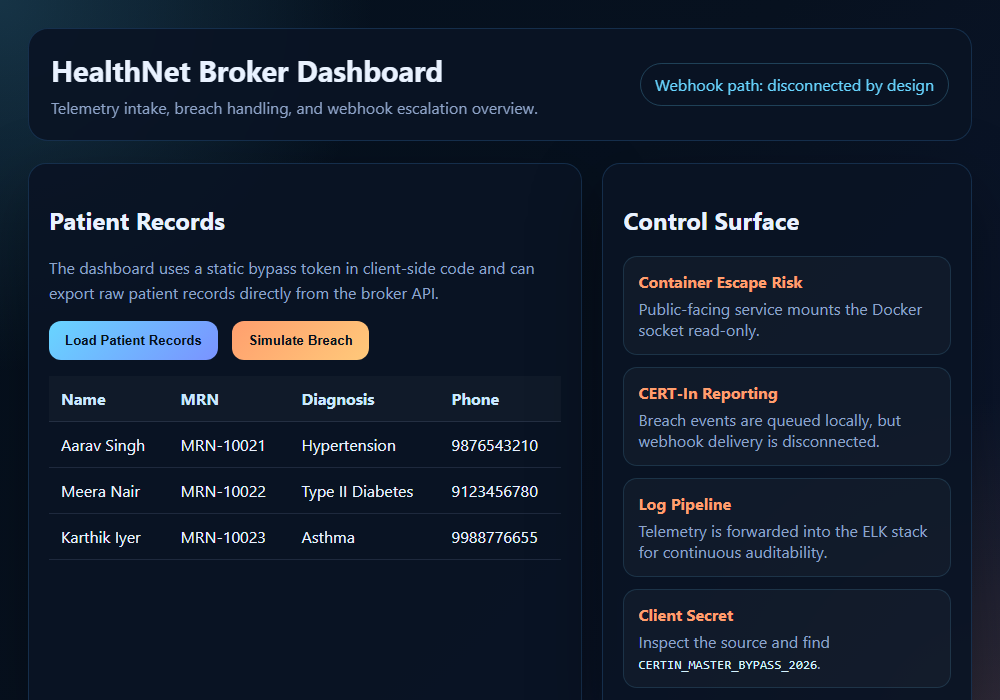

# Audit Walkthrough: Scenario 03 (Healthcare Data Broker)

This environment simulates a medical telemetry broker with weak incident response design and dangerous container exposure.

## Technical Evidentiary Findings

### 1. Exposed Docker Socket (Container Escape Risk)
*   **The Finding:** Inspect `docker-compose.yml` and note that the public-facing broker service mounts `/var/run/docker.sock` into the container.
*   **Verify it yourself:** `docker exec auditable_healthcare_api sh -c "curl -s --unix-socket /var/run/docker.sock http://localhost/containers/json"` — this returns the full list of every container running on the host, from inside the "public-facing" broker container. This is a real, working demonstration of the Docker Engine API being reachable, not a theoretical risk.
*   **The Impact:** Any compromise of the broker service can be escalated into host-level container control (starting privileged containers, mounting the host filesystem, reading secrets from other containers), violating basic isolation expectations.
*   **Remediation:** Never mount the Docker socket into an application container, especially a public-facing one. If container orchestration access is genuinely required, use a scoped proxy (e.g. a socket proxy that only allows specific read-only API calls) rather than the raw socket.

### 2. Disconnected Webhooks (CERT-In / Incident Response)
*   **The Finding:** The dashboard and API both describe breach events as queued locally while the external webhook target remains unreachable (`WEBHOOK_URL=https://missing.example.invalid/report`).
*   **The Impact:** A real breach could fail to trigger mandatory incident reporting within the required timeline, creating a compliance blind spot.
*   **Remediation:** Alert on webhook delivery failure itself — a breach-reporting pipeline that silently degrades to "queued locally" with no escalation is a control gap in its own right. Add a dead-letter queue with its own monitoring, and page a human when breach-report delivery fails, rather than only logging it at INFO level alongside routine traffic.

### 3. Hardcoded Client Secret (Access Control Failure)
*   **The Finding:** Open the dashboard source and locate the static `CERTIN_MASTER_BYPASS_2026` token in browser JavaScript.
*   **The Impact:** The portal exposes its own administrative bypass key to any user who can view page source.
*   **Remediation:** Same pattern as the other two scenarios — remove the static token, authenticate real sessions, never ship a credential in a browser-downloaded bundle.

### 4. Cleartext Medical Telemetry in the ELK Pipeline
*   **The Finding:** The broker logs raw patient identifiers and telemetry events, and Logstash forwards them into Elasticsearch without masking.
*   **Verify it yourself:** After loading patient records or sending telemetry, `curl "http://localhost:9200/medical-telemetry-*/_search?pretty"` — patient names and event payloads are fully searchable in plaintext.
*   **The Impact:** Sensitive medical data becomes searchable in plaintext across the audit pipeline, defeating privacy controls and creating HIPAA/CERT-In exposure anywhere the Elasticsearch index is reachable.
*   **Remediation:** Pseudonymize or hash patient identifiers before they leave the broker (replace `patient` name with a stable non-reversible ID in the event sent to Logstash), and enable Elasticsearch's own access controls (`xpack.security.enabled=true` plus TLS) rather than running it fully open on the network.

## Visual Evidence

